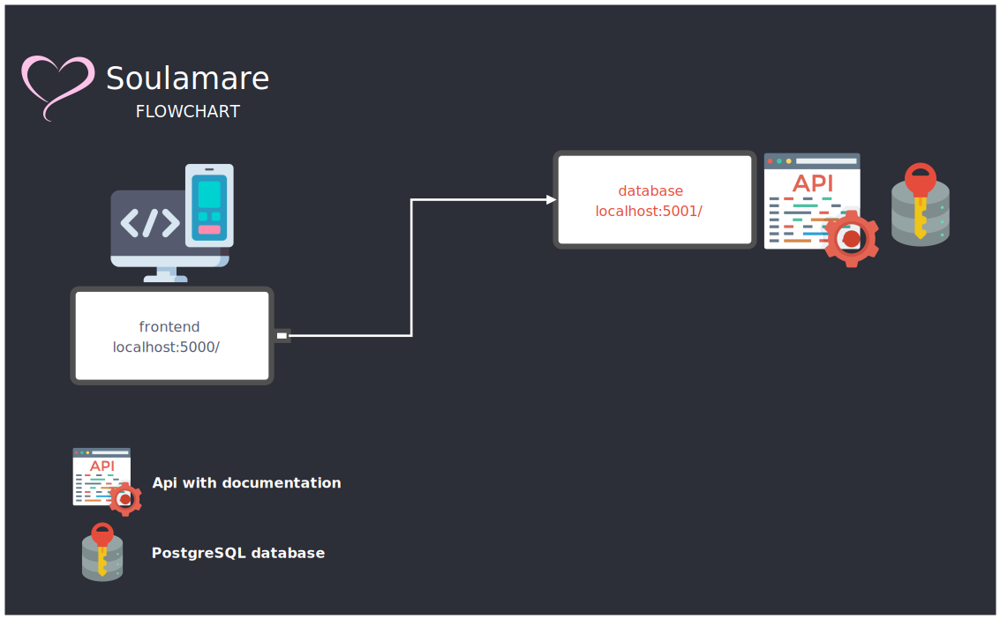

### It depends on everyone ...



**Note:** 
Soulamare is a website dedicated to helping lost souls get better:
Family life, friendships, spiritual side ...
We are also open to learning from you ... 

### Run:
```
git clone https://github.com/Martin1403/Soulamare.git && \
cd Soulamare && \
docker-compose up --build && \
docker-compose down && \
docker rmi $(docker images --format="{{.ID}}" soulamare_*) --force && \
docker volume prune
```

###### [localhost:5000](http://localhost:5000/)
###### Ctrl+C to exit.

**Note:** Ready to test, but still in development, any ideas? Do not hesitate to contact...