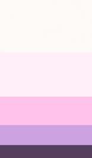
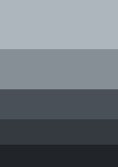

Soulamare Frontend
==================

### Venv: 
###### python3.9
```
python -m venv frontend/.venv && \
source frontend/.venv/bin/activate && \
pip install -U pip && \
pip install -r frontend/requirements.txt
```
### Run:
```
source frontend/.venv/bin/activate && \
export QUART_APP=frontend/app:app && \
export QUART_ENV=development && \
quart run -h "127.0.0.1" -p 5000
```
### Docker:
```
docker build -t app . && \
docker run -it --rm -p 5000:5000 app && \
docker rmi app --force
```
### Dev:
```
live-server
```
### Colors:

```scss
$color-main-1: #fdfbf7;
$color-main-2: #fff0f8;
$color-main-3: #ffc2e9;
$color-main-4: #cca2e1;
$color-main-5: #543e5c;
```

```scss
$color-grey-1: #adb5bd;
$color-grey-2: #868e96;
$color-grey-3: #495057;
$color-grey-4: #343a40;
$color-grey-5: #212529;
```
###### [Links:]()
- [Open colors](https://yeun.github.io/open-color/) for text colors ...
- [Colorhunt](https://www.colorhunt.co/) where color palette was chosen ...

- **Notes:**

## Branding
Headline: For those in wisdom, to finding soul


### **Project description:**
+ #### Define the project:
  - WHO the website is for: Me, friend, job ...
  - WHAT the website is for: e.g. People, who are finding (spiritual, purpose in life, satisfaction, meaning in life ...)
  - WHO is target audience: e.g. Men and women, over 33 years.
+ #### Plan the project:
  - Website content: text, images, videos etc.
  - Plan the sitemap: what pages the site needs, and how they are related to one another (content hierarchy).
  - Based on the content, plan what section each page needs in order to convey the content's message, and in which order.
  - Define the website personality.
+ ### Sketch layout and component ideas:
  - What components you need, and how you can use them in layout patterns.
  - Get ideas out of your head: sketch them. [Figma](https://app.uizard.io/)
  - You don't need to sketch everything, and don't make it perfect. At some point, you're ready to jump into HTML and CSS.
+ ### Design and build website:
  - Use decisions, content and sketches, to design and build the website with HTML and CSS. 
  - You already have layouts and components: in this step, you need to design the actual visual styles.
  - Create the design based on selected website personality: the design guidelines and inspiration.
  - Use branding: for design decisions whenever possible (colors, typography, icons, etc.)
+ ### Test and optimize: 
  - Browsers: test in all major (Chrome, Safari, Edge, Safari)
  - Mobile devices: test responsive website in real mobile devices.
  - Optimize: all images, in terms of dimensions and file size.
  - Accessibility: fix simple problems (e.g. color contrast issues)
  - Lighthouse: performance test in Chrome DevTools and try to fix report issues.
  - Search engine: optimize in (SEO)
+ ### Launch the website:
  - Upload: website files in a hosting platform. [Netlify](https://www.netlify.com/)
  - Domain: buy the great domain name (brand well, memorable and easy to write)
+ ### Maintain and updating:  
  - Updating over time: keep website content updated.
  - Analytics: install analytics software. (Google Analytics or Fathom). This may inform future changes in the site structure and content.
  - A blog: that is updated regularly is a good way to keep users coming back, and is also good for SEO.

